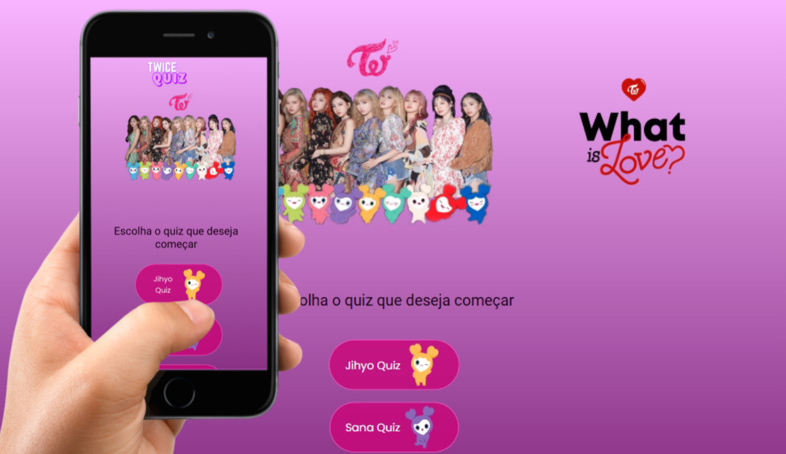

## 💻 Projeto
Esse é um projeto Web Responsivo de Quizzes do Twice.

## 🚀 Tecnologias
Esse projeto foi feito por mim durante meus estudos de Javascript, as tecnologias utilizadas foram:

- HTML
- CSS
- Javascript
- Git e Github
